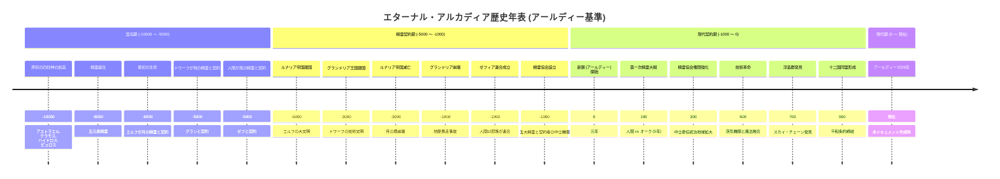
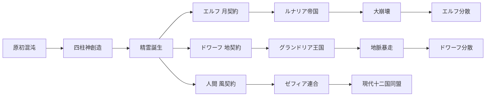
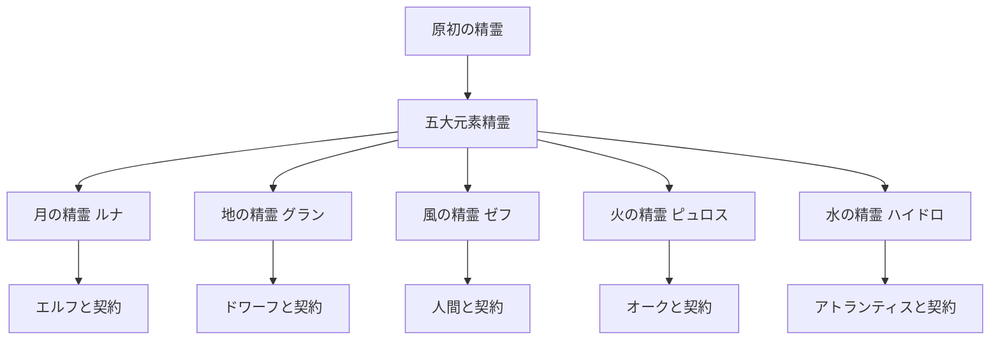
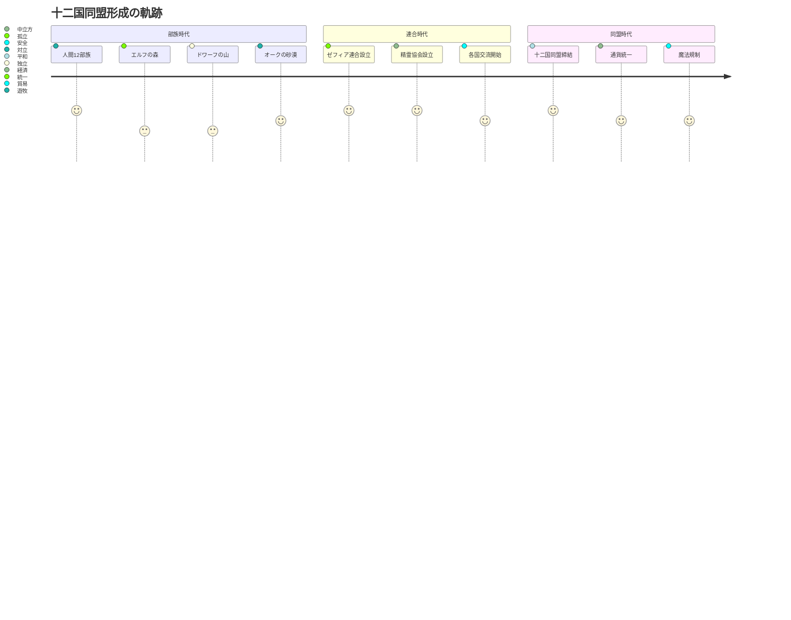
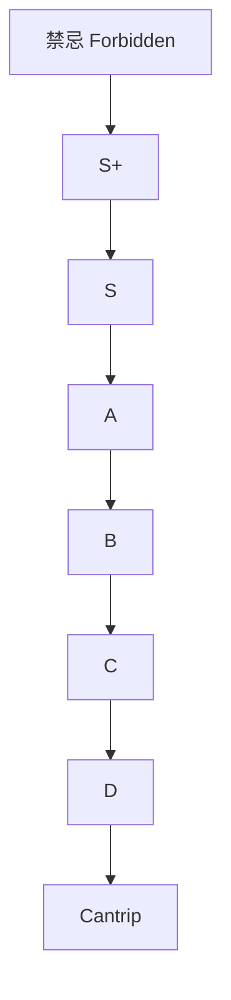

# 歴史年表 (ビジュアル版)

このページでは、エターナル・アルカディアの歴史をMermaidタイムラインで可視化します。

## 完全年表

## 主要文明の興亡

## 精霊契約の流れ

## 国家形成の流れ

## 魔法ランク体系

## 年号早見表

| 年号 (アールディー) | 西暦換算 (参考) | 出来事 |
|------------|----------------|--------|
| -10000 | -10000 | 創世 |
| -5000 | -5000 | ルナリア帝国建国 |
| -3000 | -3000 | グランドリア建国 |
| -1000 | -1000 | ゼフィア連合成立 |
| 0 | 0 | 新暦開始 |
| 100 | 100 | 第一次精霊大戦 |
| 500 | 500 | 技術革命 |
| 900 | 900 | 十二国同盟 |
| 1026 | 1026 | 現在 |

---

**関連項目**:
- [歴史年表 (テキスト版)](main-timeline.md)
- [創世神話](../lore/creation-myth.md)
- [古代文明](../lore/ancient-civilizations.md)
